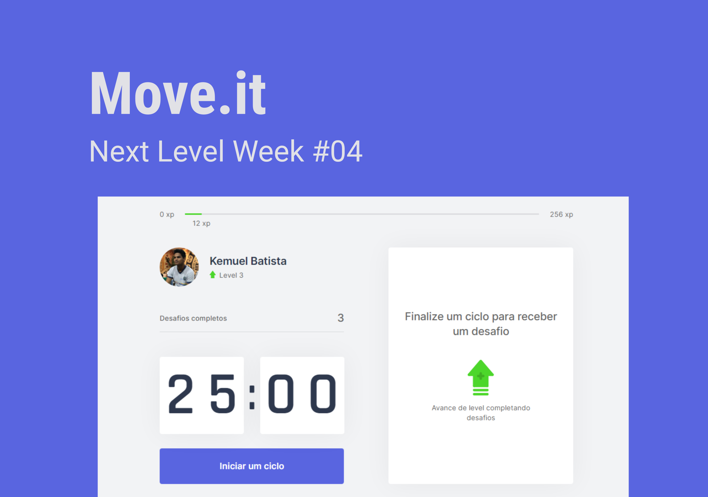

<h1 align="center">Next Level Week #04. Project "Move It Version 1.0".</h1>

  <a href="#-about">About</a>&nbsp;&nbsp;&nbsp;|&nbsp;&nbsp;&nbsp;
  <a href="#-technologies">Technologies</a>&nbsp;&nbsp;&nbsp;|&nbsp;&nbsp;&nbsp;
  <a href="#-projet">Project</a>&nbsp;&nbsp;&nbsp;|&nbsp;&nbsp;&nbsp;
  <a href="#-layout">Layout</a>&nbsp;&nbsp;&nbsp;|&nbsp;&nbsp;&nbsp;
  <a href="#memo-license">License</a>

  

<h2 align="center">About 📖</h2>
   
   

      The Move It project, developed during the Next Level Week #04, from <a href="https://rocketseat.com.br/">Rocketseat</a>, from the 22th to the 28th of February. 
      the project is based on the tendency that many when using the computer, either programming or using common things on a daily basis, do not exercise, with this the eyes get tired, 
      the body too and in the end what should be productive ends up in unproductivity 
      This event had a lot of exclusive, free content, it was simply sensational and profitable! 😄
   

   - ✅ "Towards the next level" 💪
   - ✅ "Unraveling the next js" 👀
   - ✅ "Context and components" 📌
   - ✅ "Improving the usability of the application" 🔥
   - ✅ "Next level with React" 🚀
   
 ## 🚀 Technologies

This project was developed with the following technologies:

- [Node.js] (https://nodejs.org/en/)
- [React] (https://reactjs.org)
- [React Native] (https://facebook.github.io/react-native/)
- [Expo] (https://expo.io/)
- [TypeScript] (https://www.typescriptlang.org/)

## 💻 Project

Move It is an application that helps people to exercise while using the computer 💜

## 🔖 Layout

In the links below you will find the layout of the web project. Remembering that you need to have an account at [Figma] (http://figma.com/) to access it.

- [Layout Web](https://www.figma.com/file/DWSzldsGcnMdJDVwx3ak9c/Move.it-1.0-(Copy))

##: memo: License

This project is under the MIT license. See the [LICENSE] file (LICENSE.md) for more details.

---

<h1 align="center">Next Level Week #04. Projeto Move It Versão 1.0".</h1>

 

<h2 align="center">Sobre 📖</h2>
   
   

      O projeto Move It Versão 1.0, projeto desenvolvido durante a Next Level Week #04, from <a href="https://rocketseat.com.br/">Rocketseat</a>, dos dias 22 a 28 de Fevereirobr>
      o projeto é baseado na tendência de que muitos quando usam o computador seja programando, seja utilizando coisas comuns no dia a dia não fazem exercícios, com isso os olhos ficam cansados, o corpo também e no 
      final aquilo que deveria ser produtivo acaba em improdutividade 
   

## 🚀 Tecnologias

Esse projeto foi desenvolvido com as seguintes tecnologias:

- [Node.js](https://nodejs.org/en/)
- [React](https://reactjs.org)
- [React Native](https://facebook.github.io/react-native/)
- [Expo](https://expo.io/)
- [TypeScript](https://www.typescriptlang.org/)

## 💻 Projeto

O Move It é uma aplicação que ajuda a pessoas a fazerem exercícios durante o uso do computador  💜

## 🔖 Layout

Nos links abaixo você encontra o layout do projeto web. Lembrando que você precisa ter uma conta no [Figma](http://figma.com/) para acessá-lo.

- [Layout Web](https://www.figma.com/file/DWSzldsGcnMdJDVwx3ak9c/Move.it-1.0-(Copy))

## :memo: Licença

Esse projeto está sob a licença MIT. Veja o arquivo [LICENSE](LICENSE.md) para mais detalhes.

---

Feito com ♥ by Kemuel Batista
